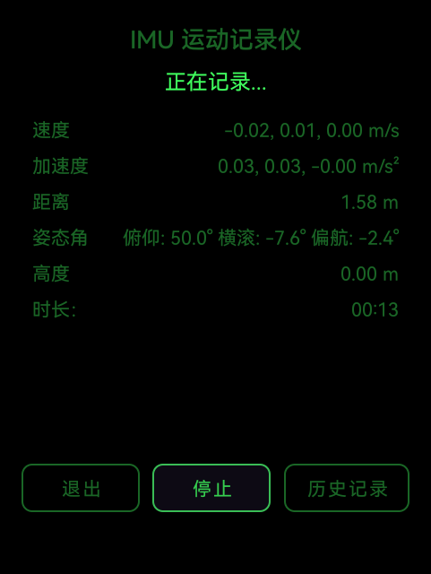
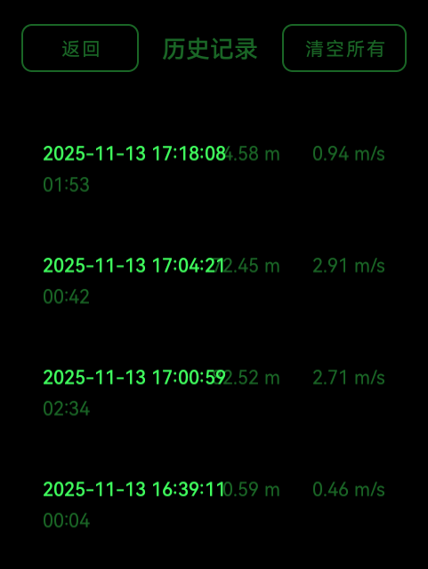
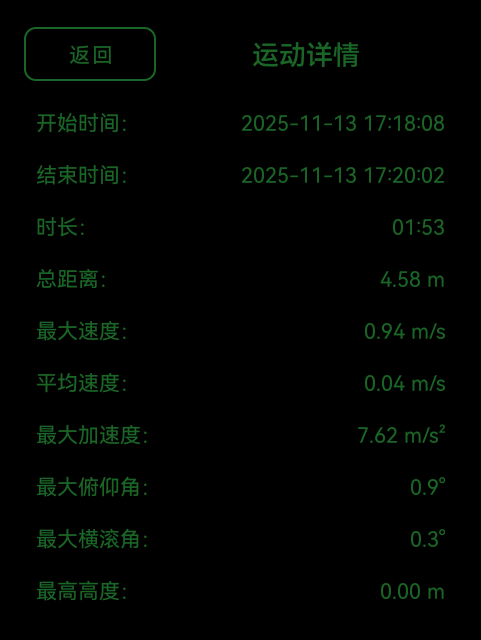

# IMU Motion Recorder 运动姿态记录器



## 简介

**IMU Motion Recorder** 是一款基于Android设备内置惯性测量单元（IMU）的运动数据记录与分析应用。它能够实时捕捉、处理和显示由加速度计、陀螺仪提供的多维度运动数据，并通过蓝牙实时传输到PC进行分析。

该项目旨在探索和实践在移动设备上进行高精度运动追踪的核心算法，包括传感器数据融合、姿态解算和漂移抑制。

### 设备信息
- **目标设备**: Glasses_5557 (Rokid智能眼镜)
- **蓝牙地址**: AC:86:D1:54:A4:A9
- **协议**: BLE (Bluetooth Low Energy) - GATT
- **服务UUID**: `0000a0a0-0000-1000-8000-00805f9b34fb`
- **特征UUID**: `0000a0a1-0000-1000-8000-00805f9b34fb`

## 核心功能

- **实时数据显示**:
    - **运动参数**: 实时显示三轴速度和三轴线性加速度。
    - **姿态解算**: 通过互补滤波器融合陀螺仪与加速度计数据，实时计算并显示设备的俯仰角（Pitch）、横滚角（Roll）和偏航角（Yaw）。
    - **运动时长**: 精确计时。

- **蓝牙数据传输**:
    - **实时传输**: 通过BLE GATT协议实时传输IMU数据到PC。
    - **无需配对**: BLE连接无需系统配对，连接更简便。
    - **数据格式**: CSV格式，包含速度、加速度和姿态角。
    - **PC接收**: 提供Python脚本（基于bleak库）用于PC端接收和保存数据。

- **高精度算法**:
    - **陀螺仪校准**: 在记录开始前自动校准陀螺仪零点偏置，为精确的姿态解算提供基础。
    - **漂移抑制**: 采用**高通-低通组合滤波器**和**零速更新（ZUPT）**算法，有效抑制加速度积分导致的漂移，确保数据在静止和低速状态下的稳定性。
    - **重力移除**: 在设备坐标系下精确移除重力分量，提取真实的线性加速度。

- **数据分析**:
    - **PC端接收**: 通过蓝牙接收并保存数据到CSV文件。
    - **实时监控**: 在终端实时查看IMU数据流。
    - **数据可视化**: 使用Python/Pandas进行后续数据分析。

- **现代化UI**:
    - 采用`Material Design`组件和`ToggleButton`设计，提供简洁、直观的用户操作体验。
    - 界面默认焦点优化，支持键盘或遥控器操作。

## 技术栈

- **语言**: Kotlin
- **架构**: MVVM (隐式，通过Activity/ViewModel分离UI与数据逻辑)
- **UI**: Android XML, Material Design Components
- **异步处理**: Kotlin Coroutines
- **通信**: Bluetooth Low Energy (BLE) - GATT Server
- **传感器**: Android Sensor Framework (加速度计, 陀螺仪)
- **PC端**: Python 3.7+, Bleak (BLE库), Pandas, Matplotlib

## 快速开始

### Android端

### Android端

1.  **请求权限**: 应用首次启动时会请求"身体传感器"和"蓝牙"权限。请允许以确保核心功能正常工作。
2.  **传感器校准**: 点击"开始"按钮后，应用会首先进入自动校准阶段。此时请将设备**静止平放**，等待校准完成（约3-5秒）。
3.  **启动蓝牙服务**: 点击"蓝牙"按钮启动蓝牙服务，等待PC端连接。
4.  **开始记录**: 校准完成后，点击"开始"按钮。你可以自由移动设备，应用会实时显示各项运动数据并通过蓝牙发送。
5.  **停止记录**: 点击"停止"按钮，本次记录将结束。
6.  **退出应用**: 在主界面点击"退出"按钮，可以安全地关闭应用。

### PC端

1. **安装依赖**:
```bash
pip install -r requirements.txt
```

2. **使用BLE接收器（推荐）**:
```bash
# 自动扫描并连接BLE设备
python ble_receiver.py

# 或使用简化版（直接连接到已知MAC地址）
python ble_simple_receiver.py
```

3. **快速连接眼镜设备（经典蓝牙）**:
```bash
# 如仍需使用经典蓝牙（需要额外安装pybluez）
python connect_glasses.py
```

**推荐使用 BLE 版本**，因为：
- ✅ 无需系统配对
- ✅ 连接更稳定
- ✅ 跨平台支持更好
- ✅ 不会与音频设备冲突

4. **数据分析**:
数据保存在 `imu_data/` 目录下的CSV文件中，可使用Python/Pandas进行分析：
```python
import pandas as pd
import matplotlib.pyplot as plt

df = pd.read_csv('imu_data/ble_imu_20231202_120000.csv')
plt.plot(df['velocity_x'], label='Velocity X')
plt.show()
```

## 文件说明

### Android端
- `app/src/main/java/com/imu/motionrecorder/`
  - `activity/` - Activity类
  - `sensor/` - 传感器管理和IMU追踪
  - `bluetooth/` - 蓝牙服务
  - `util/` - 工具类

### PC端
- `ble_receiver.py` - **BLE接收器（推荐）** - 自动扫描和保存CSV
- `ble_simple_receiver.py` - **BLE简化版** - 快速测试连接
- `bluetooth_receiver.py` - 经典蓝牙接收器（需pybluez）
- `simple_receiver.py` - 经典蓝牙简化版
- `connect_glasses.py` - 经典蓝牙快速连接脚本
- `requirements.txt` - Python依赖
- `BLE_QUICK_START.md` - **BLE版本快速开始指南**
- `BLUETOOTH_GUIDE.md` - 经典蓝牙详细使用文档

## 数据格式

蓝牙传输数据格式（CSV）:
```
velocity_x, velocity_y, velocity_z, accel_x, accel_y, accel_z, pitch, roll, yaw
```

示例:
```
0.123, 0.456, 0.789, 1.234, 5.678, 9.012, 10.5, 5.2, 90.3
```

## 常见问题

### BLE版本（推荐）
详见 [BLE_QUICK_START.md](BLE_QUICK_START.md)

### 经典蓝牙版本
详见 [BLUETOOTH_GUIDE.md](BLUETOOTH_GUIDE.md)

## 应用截图





